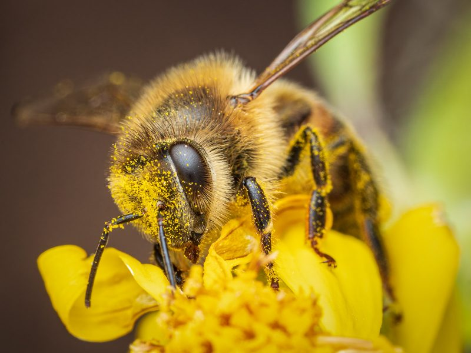

# **Web and App Development**
Hi!

## Arden Boettcher

### Markdown practice

###### Oh look a bee!

Do you want to know how I got a bee in here?
[python tutorial for beginners](https://www.youtube.com/watch?v=fWjsdhR3z3c&pp=ygUUcHl0aG9uIGZvciBiZWdpbm5lcnM%3D)
Or do you want to buy something?
[amazon](https://www.amazon.com/)

``print('hello world')``

## **About Me**
- **I can bend my fingers more than you can**
- *I have the best cat in the whole class*
